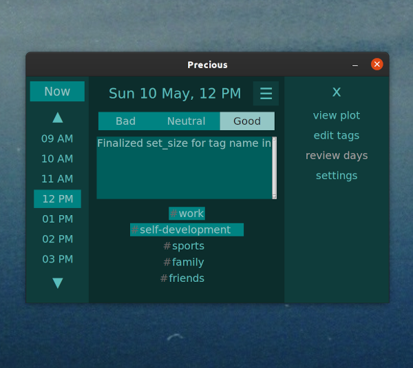

# Precious App
Time is precious, so log what you did every hour, use tags. Later you can view a plot of your progress and see some very nice insights about your productivity patterns.

It has been proven that reviewing your days helps you increase productivity and improves your mood because you feel more in control and see tangible improvements of your life and personality. Logging your hours helps you value every hour while catching yourself on how you get lazy or procrastinate. This app is a simple tool that can do wonders.

# Screenshots


# How to launch
```python3 precious.py```

# PySimpleGUI
This library is used to create the GUI of the app

All docs are here https://pysimplegui.readthedocs.io/en/latest/

# Requirements
As per PySimpleGUi docs for development need to install tkinter

```apt-get install tkinter```

AND

```pip install pysimplegui```

or (usually needed on linux)

```pip3 install pysimplegui```

sqlite (in Python) is used for database management and should be installed in your Python


# TODO

## For first release:

- [x] Autosave hour all the time, on every click or even with timer (autosave) — that’s how notes do it
- [x] Textarea adds \n on every save, remove the last \n from text…
- [x] Status text should be on the left bottom
- [x] Click on “up” should move one hour up, same with “down” — hour down
- [x] Arrow up/down should do the same as arrow up/down buttons in GUI
- [x] “Now” button should show current hour from the system
- [x] “Plot” button in menu should open the window with a canvas ready for plotting
- [x] Saving hour should not remove # from tags, need to add # in update_tags function
- [x] Hour text should be empty if hour has not been saved yet
should offer to go to Next day which rolls hours so that 1AM is at the top
- [x] Default tags should be: “work”, “self-development”, “sport”, “family”, “friends”
- [x] Design the colours fully for dark mode, use green colours from the logo — nice to keep the theme going
- [x] Tags edit function should be less hidden -- Upd: done in a minimal way now, open editing from menu.
- [x] Save tags
- [ ] Save last window position and open app window where it was last opened
- [ ] Add/delete tags, delete should ask for confirmation (popup) as it deletes all connections too
- [ ] 5 tags used lately shown at the top. Click "more" - open scrollable column of all tags
- [ ] Edit tags should have a scrollable column with input texts
- [ ] How to make a perma-app in sidebar on Linux/Mac/Windows -- Work it out, release the app.

After these are done -- the app v0.5beta will be released.

## Features for later 
In order of importance from high (to be done first) to low.

The list below once complete will be v1.0 of the app:

- [ ] “Review days” in menu should load the day logging — text area should the day, label shows day, save button has “save day”, need somewhere “back to hours” which leads to the current hour of the chosen day. List of hours should show days in the day mode. Now button should be “today”.
- [ ] Export and import data (save things, backup db etc.) -- can be in settings for simplicity
- [ ] Plotting: overview of the day -- all hours
- [ ] Plotting: overview of the week -- days with good/neutral/bad hours stacked per each day so you can see the comparison
- [ ] Plotting: overview of the month (same as week)
- [ ] Plotting: by tag -- day/week/month
- [ ] Plotting: main page -- insights -- deduce best times of the day etc.

V1+ list (nice to have later, but can live without):

- [ ] Settings: Choose between 24hr OR PM/AM mode
- [ ] Encryption: encrypt when saving, decrypt when showing. Do with dummy auto password as first to test
- [ ] Encryption: need to set up password for encryption and use it to encrypt, don't forget to show warnings, offer to backup existing data before encrypting
- [ ] Button up from 5AM should offer to go to Previous day which rolls hours so that 5AM is at the bottom. Below 12AM 
- [ ] Design the colours fully for light mode, use green colours from the logo — nice to keep the theme going
- [ ] Settings: dark mode / light mode
- [ ] Settings: Show tip of the day on launch on/off
- [ ] Tip of the day: a separate little window with a tip, would be cool to draw isometric art for this i.e. “look at yourself from a 3rd person view — person at a phone sitting with a health bar?” Create a few tips and show them at random. Tips are shown at launch of the setting is not off (default: on)
